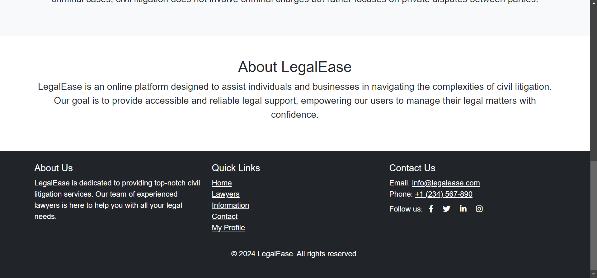
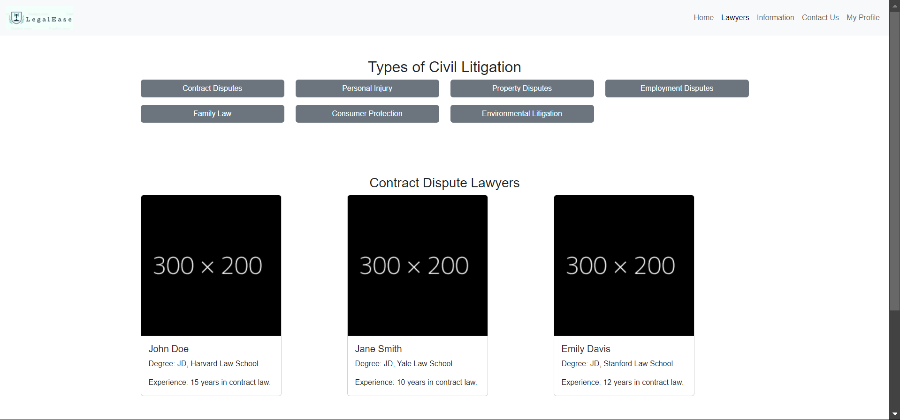
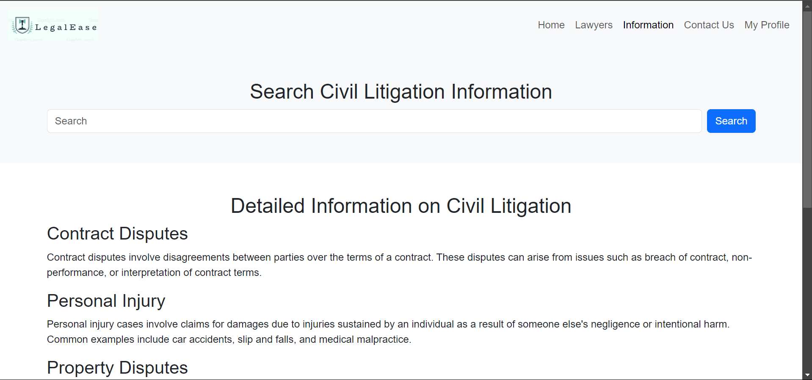
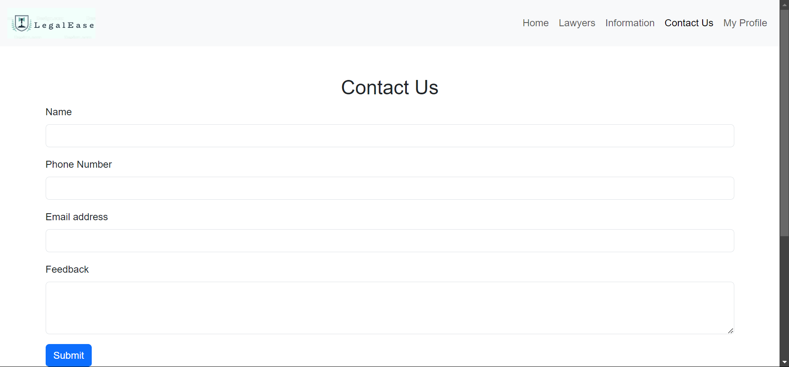
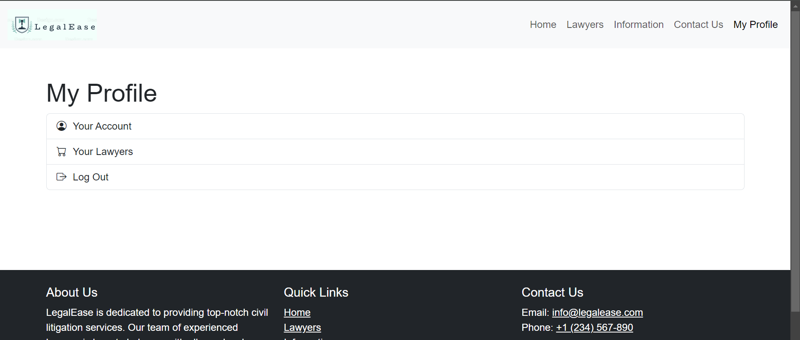

# LegalEase - Civil Litigation Website

## Screenshots

### Home Page

### Footer

### Lawyers Page

### Information Page

### Contact Us Page

### My Profile Page

## Overview

LegalEase is a civil litigation website designed to provide users with detailed information about civil litigation, connect them with experienced lawyers, and allow them to sign up for personalized services. The website is built using HTML, CSS, and Bootstrap, and features pages for general information, lawyer profiles, and a signup form.

## Features

- **Home Page**: An introduction to civil litigation and an overview of the services provided by LegalEase.
- **Lawyers Page**: Displays a list of lawyers with their profiles, including their degree, experience, and areas of expertise in civil litigation.
- **Information Page**: Contains detailed information about civil litigation with a search bar to help users find specific topics.
- **Contact Us Page**: Allows users to get in touch with the LegalEase team via email, phone, or social media. Includes a feedback form for user inquiries.
- **Sign Up Page**: New users can sign up for an account with LegalEase.

## Technologies Used

- **HTML5**: For the structure and content of the pages.
- **CSS3**: For styling the website and ensuring it is responsive.
- **Bootstrap 5**: For responsive design, prebuilt components, and layout management.
- **FontAwesome & Bootstrap Icons**: For icons and visual enhancements.
- **GitHub Pages**: For hosting the website.

